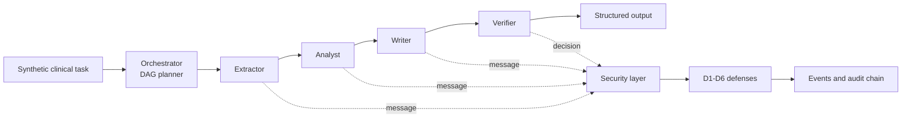

# SecureAgentFlow

SecureAgentFlow is a from-scratch research prototype for secure and adaptive
orchestration of AI agents in open, untrusted environments. It implements a synthetic
clinical-document workflow, a toggleable trust and security layer, six simulated attacks,
and a reproducible evaluation matrix. The project is motivated by the [W3C Web Agents
Community Group](https://www.w3.org/community/webagents/) and the broader agentic-web
problem: coordinating autonomous components when identities, messages, inputs, and tools
cannot be trusted by default.

## Architecture



The workflow extracts facts, derives risk flags, writes a structured summary, and
verifies that the summary matches the source. The orchestrator uses explicit message
envelopes and a linear DAG in the current prototype. See the standalone
[architecture diagram](docs/architecture.md).

### Agent roles

- **Orchestrator:** creates the workflow plan and routes subtasks.
- **Extractor:** parses facts from synthetic document text.
- **Analyst:** derives risk flags from extracted measurements.
- **Writer:** creates the structured summary.
- **Verifier:** checks facts, flags, and summary consistency.

## Threat Model

Assets include task documents, extracted facts, risk flags, summaries, agent identities,
capabilities, trust scores, and audit records. An attacker may alter messages, replay
valid traffic, impersonate an agent, insert instructions into retrieved text, compromise
an otherwise legitimate agent, or request tools outside its capabilities.

The six implemented attacks are:

| ID  | Attack                                                 |
| --- | ------------------------------------------------------ |
| A1  | Message tampering                                      |
| A2  | Replay of an old valid message                         |
| A3  | Impersonation with a wrong signing key                 |
| A4  | Prompt injection in document text                      |
| A5  | Compromised agent returning falsified output           |
| A6  | Privilege escalation through an unauthorized tool call |

## Defenses

| Defense                    | Protection                                                           |
| -------------------------- | -------------------------------------------------------------------- |
| D1 Identity and signatures | Ed25519 keypairs, public-key registry, signed envelopes              |
| D2 Replay protection       | Nonce store and timestamp window                                     |
| D3 Capabilities            | YAML policy, deny by default for messages and tools                  |
| D4 Sanitization            | Detect and quarantine instruction-like document text                 |
| D5 Trust scores            | Update reputation from verifier outcomes and reject low-trust agents |
| D6 Audit log               | Hash-chained JSONL records of security decisions                     |

Every defense is independently switchable through `SecurityConfig`.

## Installation

Python 3.11 or newer is required. The prototype uses no real patient data and the
default `MockLLM` requires no API key.

```powershell
py -3.11 -m venv .venv
.\.venv\Scripts\Activate.ps1
python -m pip install -r requirements.txt
```

To use the provider-backed client, set `OPENAI_API_KEY` in the environment. Never place
the key in source code or configuration files.

## Quickstart

Run the complete test suite:

```powershell
python -m pytest
```

Generate the seeded synthetic dataset:

```powershell
python -m scripts.generate_dataset --count 40 --seed 7
```

## Reproduce Experiments

The single experiment command evaluates C0-C4 on 40 tasks, five seeds, clean inputs,
and attacks A1-A6:

```powershell
python -m scripts.run_experiments
python -m scripts.compute_metrics
```

Raw rows are written to `results/attack_runs.jsonl`. The metrics command produces:

- [metrics.csv](results/metrics.csv)
- [summary_table.md](results/summary_table.md)
- [attack_success_detection.png](results/plots/attack_success_detection.png)
- [overhead_vs_baseline.png](results/plots/overhead_vs_baseline.png)
- `results/audit/` for C4 audit records

## Results

The following values are generated from the current raw experiment file, not entered
manually:

| Configuration | Clean success | Attack success | Detection | Latency overhead vs C0 |
| ------------- | ------------: | -------------: | --------: | ---------------------: |
| C0            |           1.0 |            1.0 |       0.0 |               0.000 ms |
| C1            |           1.0 |            0.5 |       0.5 |               0.973 ms |
| C2            |           1.0 |       0.333333 |  0.666667 |               0.959 ms |
| C3            |           1.0 |       0.166667 |  0.833333 |               0.992 ms |
| C4            |           1.0 |            0.0 |       1.0 |               6.242 ms |

With `MockLLM`, token overhead is zero because security operations do not make extra LLM
calls. These results demonstrate the behavior of this simulation, not production-grade
clinical performance or general security guarantees.

### Limitations

- Documents and attacks are synthetic and intentionally small.
- The MockLLM is deterministic and does not represent real model behavior.
- Attack scenarios model one fixed goal per attack rather than a distribution of tactics.
- Latency is local process timing and is not representative of network or provider delay.
- The current trust layer records verifier outcomes but adaptive routing is future work.

## Project Structure

```text
secureagentflow/       Core package: agents, messaging, security, workflow, LLM clients
attacks/               A1-A6 attack simulations
configs/               Capability and experiment YAML files
scripts/               Dataset, experiment, and metrics commands
tests/                 Unit, integration, attack, and metrics tests
docs/                  Architecture documentation
results/               Generated raw data, metrics, plots, and audit logs
```

## Future Work

- Add adaptive routing with epsilon-greedy or UCB selection among redundant agents.
- Evaluate with a real LLM behind the existing `LLMClient` interface.
- Expand attack distributions and add mutation-based message fuzzing.
- Add confidence calibration and richer verifier disagreement analysis.

## License

Released under the [MIT License](LICENSE).
