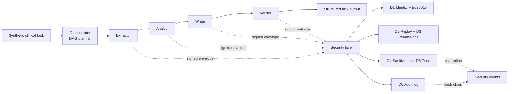

# SecureAgentFlow Architecture

```mermaid
flowchart LR
    T[Synthetic clinical task] --> O[Orchestrator\nDAG planner]
    O --> E[Extractor]
    E --> A[Analyst]
    A --> W[Writer]
    W --> V[Verifier]
    V --> R[Structured task output]

    E -. signed envelope .-> S[Security layer]
    A -. signed envelope .-> S
    W -. signed envelope .-> S
    V -. verifier outcome .-> S
    S --> I[D1 Identity + Ed25519]
    S --> P[D2 Replay + D3 Permissions]
    S --> X[D4 Sanitization + D5 Trust]
    S --> L[D6 Audit log]

    X -. quarantine .-> Q[Security events]
    L -. hash chain .-> Q
```

The baseline C0 bypasses the security layer. C1-C4 progressively enable identity and
replay protection, permissions, sanitization, trust scores, and audit logging.
